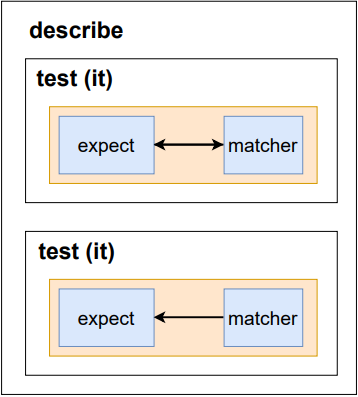

# React Testing

### 테스팅의 장점

-   디버깅 시간의 단축
-   안정적인 애플리케이션

### React Testing Library

**[📄 `React Testing Library` Document](https://testing-library.com/docs/react-testing-library/intro/)**

DOM Testing Library란 DOM 노드를 테스트하기 위한 가벼운 솔루션이다.

React Testing Library는 React 구성 요소 작업을 위한 API를 추가하여 DOM Testing Library 위에 구축된다.

### Jest

Meta에 의해 만들어진 테스팅 프레임워크로써, Test Case를 만들어서 애플리케이션 코드가 잘 돌아가는지 확인해준다.

-   `<파일이름>.test.js` 이름을 가진 파일을 찾아서 Jest가 테스팅을 실행한다.

#

**Jest 파일 구조**

-   `describe` : 여러 관련된 테스트를 그룹화하는 블록을 만든다.
-   `test` : 개별 테스트를 수행하는 곳이며, 각 테스트를 작은 문장처럼 설명한다.

-   `expect` : 기대하는 값을 테스트할 때 사용되며, matcher와 함께 사용한다.
-   `matcher` : 다른 방법으로 값을 테스트하도록 사용한다.



#

-   `render` : Testing DOM에 컴포넌트를 렌더링하는 함수로써, 인자로 렌더링할 React 컴포넌트가 들어간다.

```jsx
import { render, screen } from "@testing-library/react";
import App from "./App";

test("renders learn react link", () => {
    render(<App />);
    const linkElement = screen.getByText(/learn react/i);
    expect(linkElement).toBeInTheDocument();
});
// toBeInTheDocument === matcher
```

#

**쿼리 함수란?**

페이지에서 DOM 요소를 찾기 위해 테스트 라이브러리가 제공하는 방법으로, `get`, `find`, `query`와 같은 여러 유형의 쿼리가 있다.

-   `getBy` : 쿼리에 대해 일치하는 노드를 반환하고 일치하는 요소가 없거나 둘 이상의 일치가 발견되면 설명 `오류`를 발생시킨다.

    -   둘 이상의 요소가 예상되는 경우 `getAllBy`를 사용한다.

-   `queryBy` : 쿼리에 대해 일치하는 노드를 반환하고 일치하는 요소가 없으면 `null`을 반환한다.

    -   둘 이상의 일치 항목이 발견되면 `오류`가 발생하며 이를 방지하기 위해 `getAllBy`를 사용하자.

-   `findBy` : 주어진 쿼리와 일치하는 요소가 발견되면 `Promise`를 반환한다. 주로 `async`와 `await`와 함께 사용한다.

#

### ESLint 설정

테스팅할 때, matcher를 알맞게 쓰는지 확신이 들지 않을 때 주로 사용하는 모듈로써, 아래와 같은 설정이 필요하다.

package.json에서 아래 부분을 삭제하자.

```json
"eslintConfig": {
    "extends": [
      "react-app",
      "react-app/jest"
    ]
  },
```

Root Directory 아래에 `.eslintrc.json` 파일을 생성하고 아래 코드를 작성한다.

```json
{
    "plugins": ["testing-library", "jest-dom"],
    "extends": [
        "react-app",
        "react-app/jest",
        "plugin:testing-library/react",
        "plugin:jest-dom/recommended"
    ]
}
// "plugin:testing-library/react" : 테스트 라이브러리 중 React에 관한 규칙 설정
// "plugin:jest-dom/recommended" : jest-dom 모든 규칙 중 추천된 규칙만 설정
```

#

### TDD란?

실제 코드를 작성하기 전에 테스트 코드를 먼저 작성하는 개발 방법

#

### Qeury 우선 사용 순위

`getByTestId()` ➡️ `getByRole`

`fireEvent` ➡️ `userEvent`

#

### Mock Service Worker

브라우저에 `Service Worker`를 등록하여 외부로 나가는 네트워크 Request를 감지한다.

그리고 그 요청을 `실제 서버로 갈 때 중간에 가로채서` MSW 클라이언트 사이드 라이브러리로 보낸다.

그 후, 등록된 `핸들러에서 요청을 처리`한 후 `모의 응답을 브라우저로 보낸다.`

**[📄 `MSW` Document](https://mswjs.io/docs/getting-started/mocks/rest-api)**
